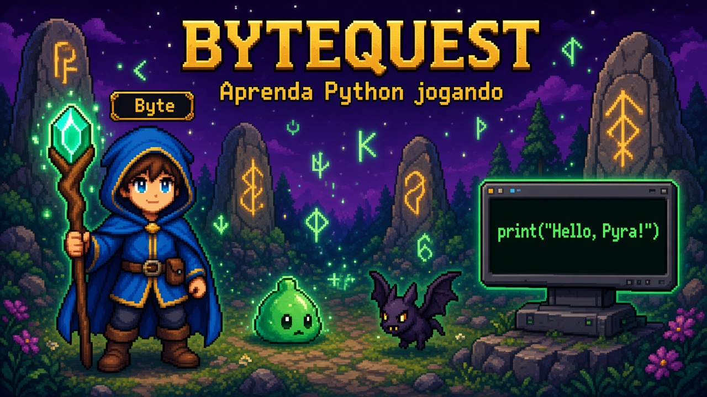

# BYTEQUEST: The Lost Source



Um RPG 8-bit gratuito, no navegador, que ensina **Python do zero** através do próprio jogo.
Sem cadastro, sem backend, sem serviços pagos. Progresso salvo em `localStorage`.

## Jogar

```bash
npm install
npm run dev    # http://localhost:5173
```

## Sobre o jogo

Você é **Byte**, um jovem aprendiz no mundo mágico de **Pyra**. Python era a linguagem ancestral que alimentava tudo — até a corrupção quebrá-la. Agora Byte decifra **monólitos de runas** (desafios de código), combate **monstros-bug** (encontros de debug) e restaura o mundo com a ajuda de **Mestre Pyron** e **Pip**.

## O que você aprende

| Mundo | Título | Conceitos Python |
|---|---|---|
| 0 | O Primeiro Shell | `print()`, comentários, leitura de erros |
| 1 | Vale das Variáveis | variáveis, tipos, `input()`, f-strings |
| 2 | Forja dos Operadores | operadores aritméticos, lógicos e de comparação |
| 3 | Cavernas da Condição | `if`/`elif`/`else`, `and`/`or`/`not` |
| 4 | Floresta dos Loops | `for`, `while`, `range`, `break`/`continue` |

Cada mundo: **3 lições de runa + 1 desafio de boss** + encontros com 5 tipos de bugs.

## Funcionalidades

- Python real executado via **Pyodide** (WebAssembly) em Web Worker com timeout
- Sistema de runas com validação por testes ocultos (`assert`)
- Motor de dicas progressivas (5 níveis)
- Mapa-múndi com desbloqueio progressivo de mundos
- Personagens animados (Byte, Pip, NPCs) com sprites 8-bit
- 5 mundos ilustrados com máscaras de caminhabilidade
- UI, diálogos e erros em **português brasileiro**
- Acessibilidade: modo reduzir movimento, escala de fonte

## Stack técnica

| Camada | Tecnologia |
|---|---|
| Jogo | Phaser 4 + TypeScript |
| Python | Pyodide (CDN jsdelivr, lazy-load) |
| Build | Vite 8 |
| Testes | Vitest (8 suites) |
| Persistência | localStorage |

## Desenvolvimento

```bash
npm run dev        # servidor de desenvolvimento
npm run build      # build de produção → dist/
npm run typecheck  # TypeScript (app + worker)
npm test           # Vitest
```

## Estrutura

```
curriculum/worlds/   → conteúdo educacional (JSON por mundo)
src/game/          → cenas, sprites, mapas, efeitos
src/education/     → validador, dicas, bugs, mapa de mundos
src/python/        → runner Pyodide + tradução de erros
src/ui/            → terminal, diálogo, HUD, configurações
public/assets/     → sprites, backdrops, thumbnails
scripts/           → pipeline de arte (Python)
tests/             → testes automatizados
```

## Status

**v0.1.0** — 5 mundos jogáveis (0–4), 20 desafios verificados, 5 tipos de bug.
Roadmap: 14+ mundos adicionais (strings, coleções, funções, OOP, async…).

## Documentação

- [ARCHITECTURE.md](ARCHITECTURE.md) — decisões técnicas e fluxo do jogo
- [CURRICULUM.md](CURRICULUM.md) — currículo educacional completo

## Licença

MIT — ver [LICENSE](LICENSE)
